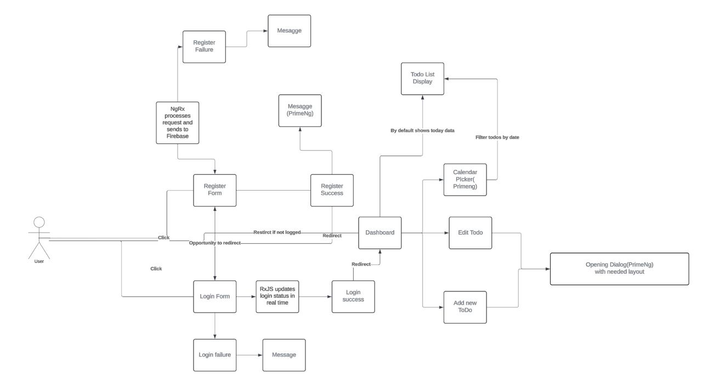
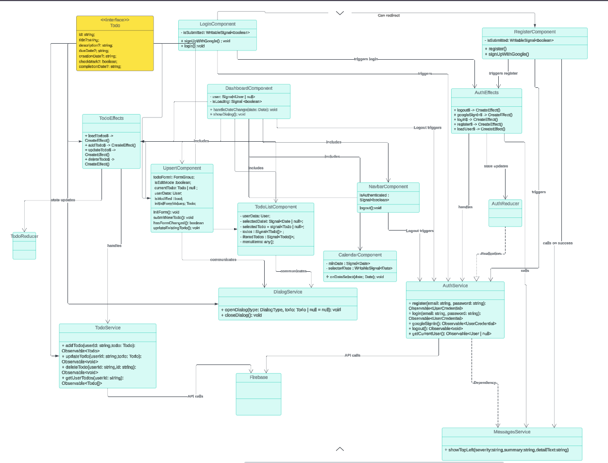

# TodoList middle promotion - Angular 17+ with Firebase and NgRx

TodoList is a **task management application** built with **Angular 17+**, **Firebase**, and **NgRx** and **RxJs**.

This application supports **real-time task management**, **authentication with Firebase**, and **state management using NgRx**.

## **Key Features for (non-technical)**

## **Key Features**


- **User Authentication** with Firebase (Email/Password, Google Sign-In)
- **State Management** using NgRx (Actions, Reducers, Effects, Selectors)
- **Real-time Task Synchronization** with Firestore and Database
- **Lazy Loading** for improved performance
- **Reactive Forms with Validation**
- **PrimeNG** for an intuitive UI

---

## **Prerequisites**

Ensure the following dependencies are installed before setting up the project:

- **Node.js (LTS version)** – [Download](https://nodejs.org/)
- **Angular CLI (Latest Version)** – Install globally using:
  ```sh
  npm install -g @angular/cli
